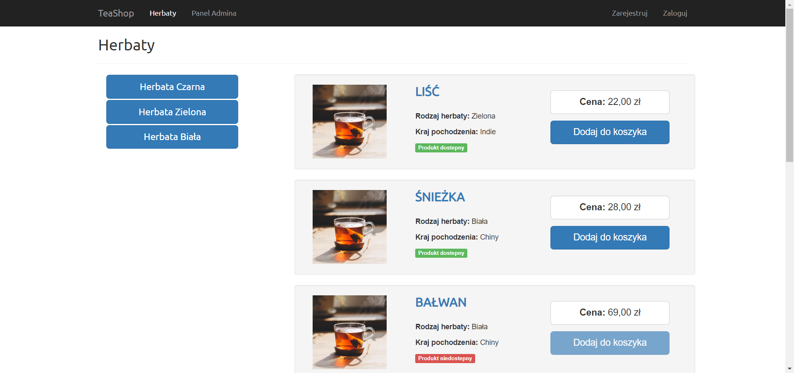
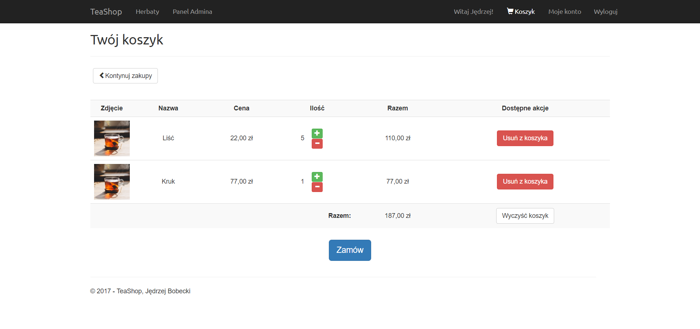
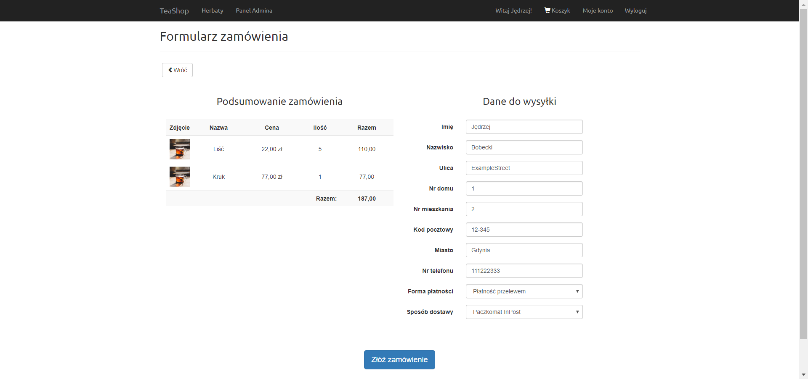
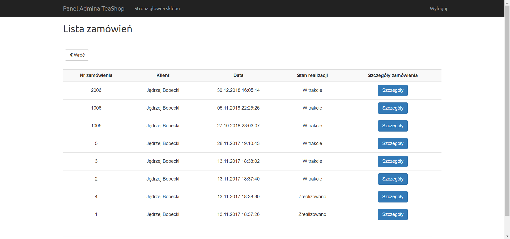
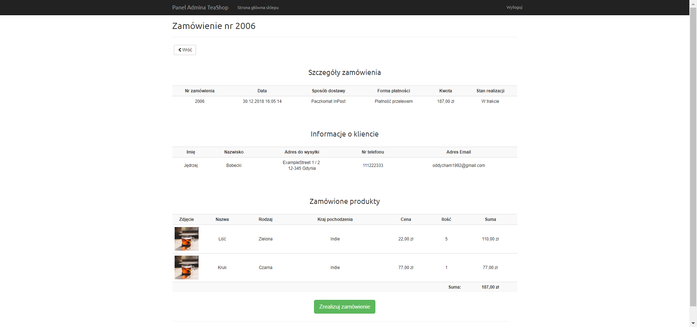
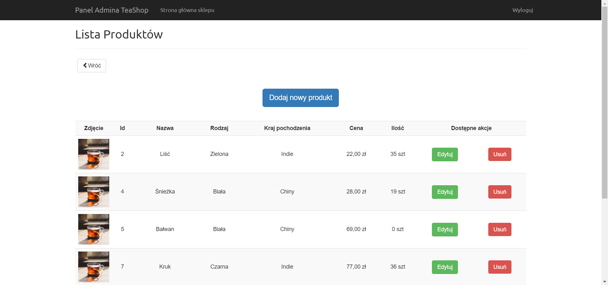

# TeaShop
E-commerce application created with ASP.NET Core MVC (.NET Core 1.1)

This project has been done for my master's degree thesis "Programming web applications with ASP.NET Core based on the example of e-commerce application"

Projekt został wykonany na potrzeby mojej pracy magisterskiej pt. "Programowanie aplikacji webowych za pomocą ASP.NET Core na przykładzie aplikacji e-commerce"

<h1>Frontend screenshots</h1>
 

 

 

 

 

 

 
